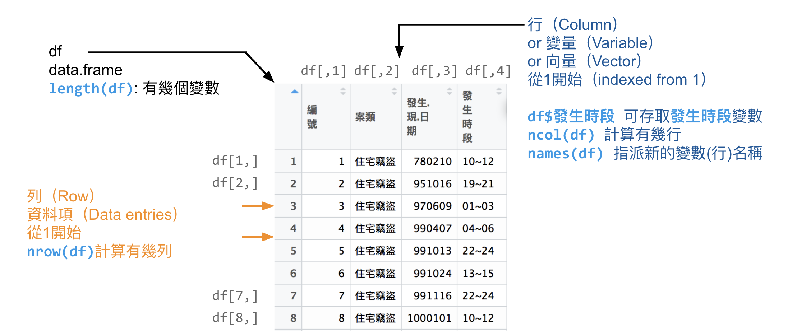
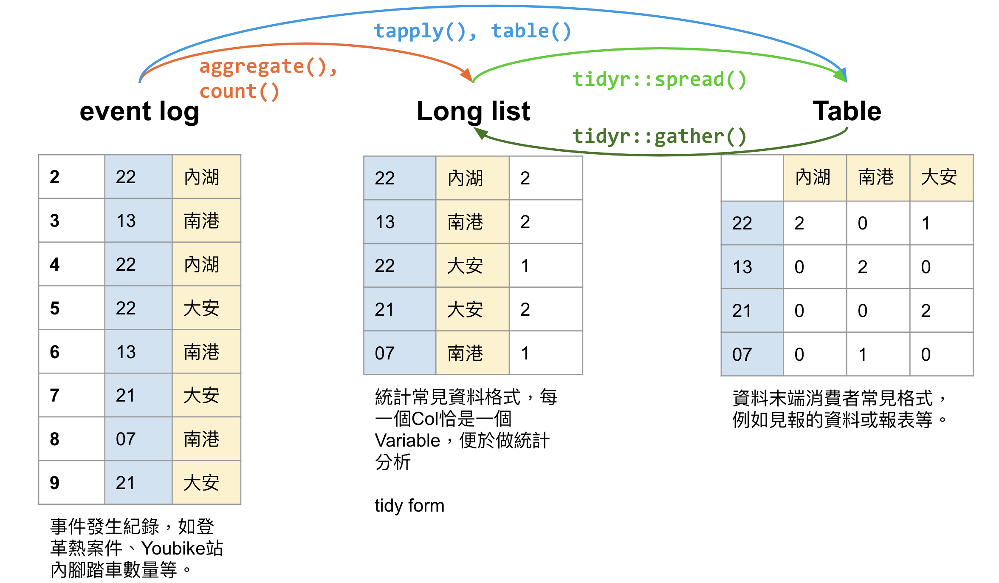
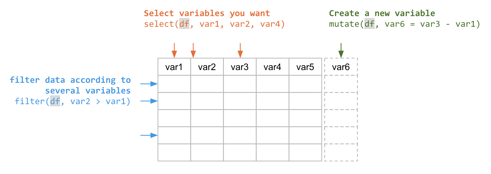

# https://github.com/P4CSS/DSSI107

# DSSI107 R Part

* Instructor: Hsieh, Ji-Lung 謝吉隆, Graduate Institute of Journalism, NTU. jerryhsieh(@)ntu.edu.tw
* Course assistants:
* [Youtube Video for review](https://www.youtube.com/playlist?list=PLK0n8HKZQ_VfJcqBGlcAc0IKoY00mdF1B)
* [Q&A 如編碼相關問題](QA.md)
* [Assignments]()

## Recommended books

* **[R for data science](http://r4ds.had.co.nz/introduction.html)**
* **[Text mining using r](http://tidytextmining.com/)**
* [Good jiebaR introduction](http://blog.fens.me/r-word-jiebar/)
* http://www.rdatamining.com/
* [Datacamp for R](https://www.datacamp.com/courses/tech:r)
* [Online books made by Bookdown](https://bookdown.org/)

# Announcement
* 因為老師習慣照課程進行更新程式碼或講義，所以**每週上課前務必重新下載或clone本repository**。
* 本門課的教學著重在「怎麼用」程式碼解決問題，所以會略過一些基本資料型態的繁瑣定義或說明。建議初學者務必熟做Datacamp上的練習，過去教學過程中證實相當多同學受益於上課內容和線上內容的對應。也可以自行找一本R的書籍，都是相當好的幫助。

# Calendar

## 10/08 Read JSON

## 10/01 Read CSV to data.frame
* Slide: [R01 Basic](https://docs.google.com/presentation/d/1gvWK2qDZuwR7lRrCLfVwfzrMBt1Dw2yFcG8LeoNgLrA/edit?usp=sharing)
* Slide: [R02 read_csv](https://docs.google.com/presentation/d/1vzJL2YU-kWKeM66bLxRFrdXLleWC_mbRFhXi-xkDuqM/edit?usp=sharing): Taipei theft, paid maternity leave, ...
* [Assignment #2](https://github.com/P4CSS/DSSI107/blob/master/Assignments.md#assignment-2-no-later-than-1007-2359-3-points)

##  09/17 R Basic
* Slide: [Introducion to R for data science](https://docs.google.com/presentation/d/e/2PACX-1vTSSfrUAnwy-mlcA7I3YBj1NeCTZY6z8b--cuyOqtg-p7-GbMmF11JejhGb6sOoogBbaSKMxpYSLcem/pub?start=false&loop=false&delayms=3000)
* Slide: [Installing R and RStudio](https://docs.google.com/presentation/d/e/2PACX-1vSNj-P2-8cJptSy-eRMKXs4eSNgLgeaCHiF22THEDkmijIXaqFA8U67T3Lp-iR0ibXssD-NHUq5DEG2/pub?start=false&loop=false&delayms=3000&slide=id.g27addf16d4_0_67)
* Be sure to submit Assignment #1 to ceiba before the next class(No later than 10/01).

# Images

---

---

